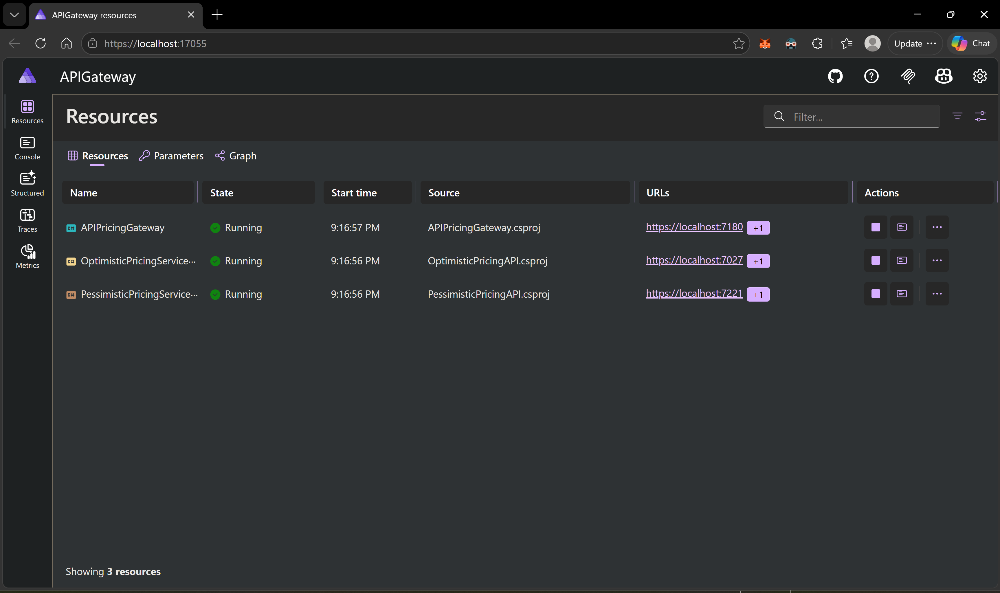
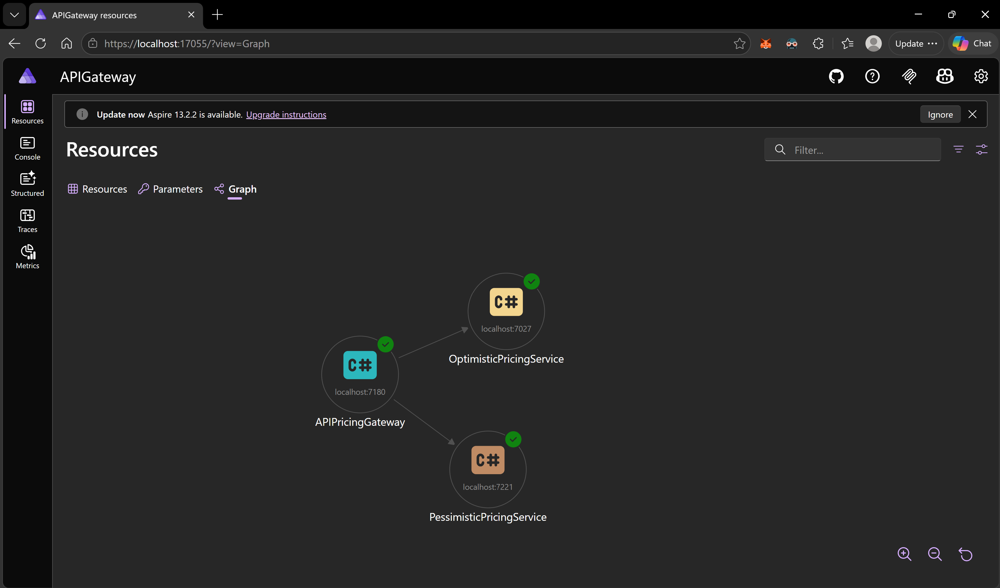
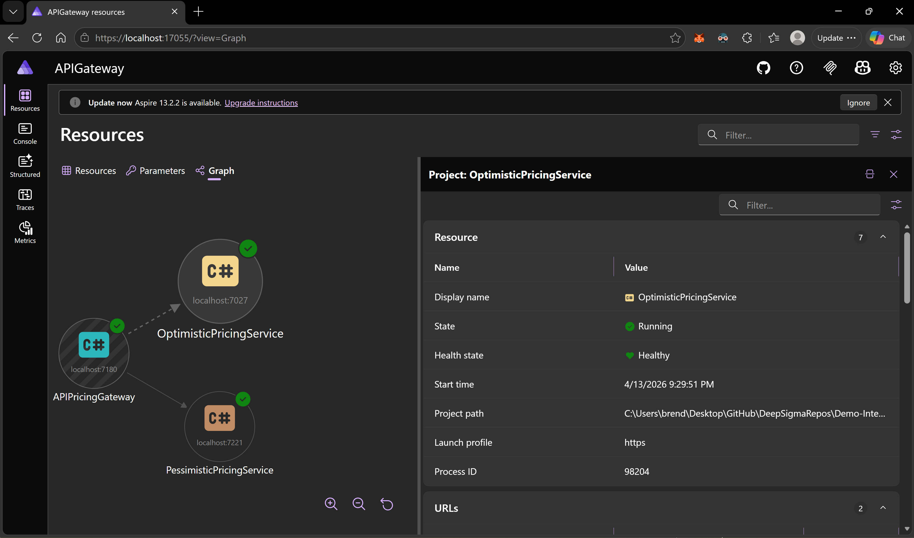
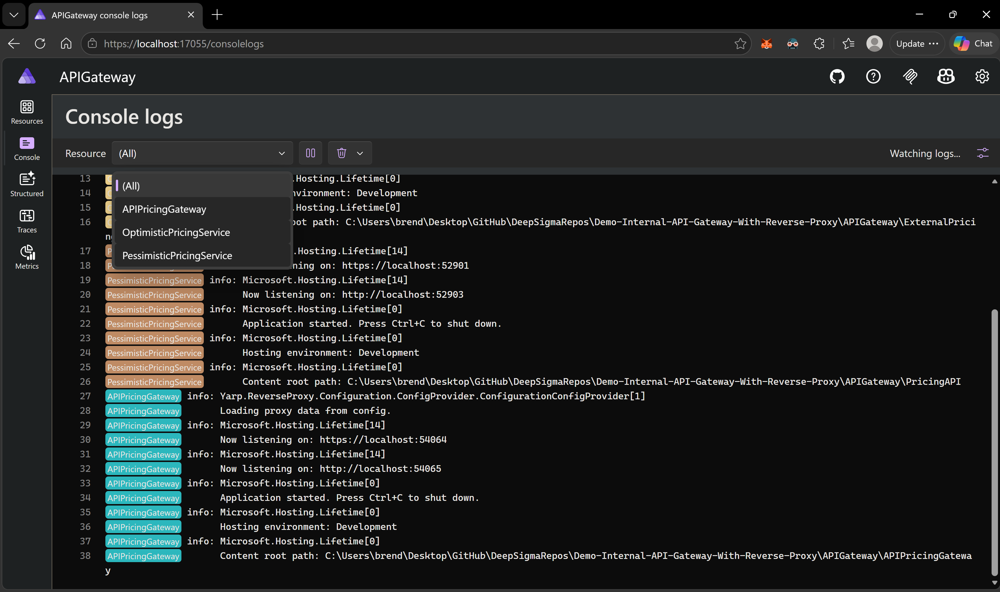
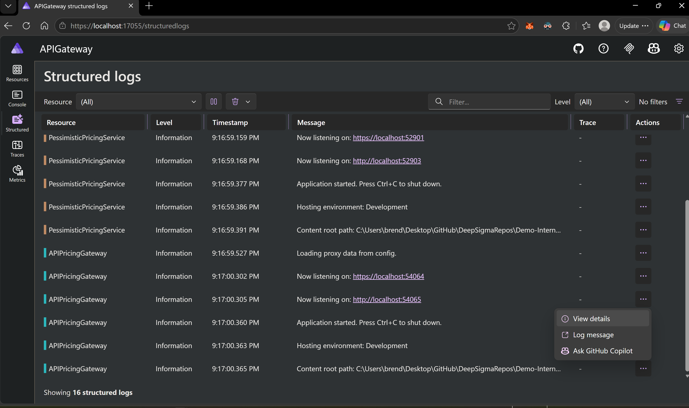
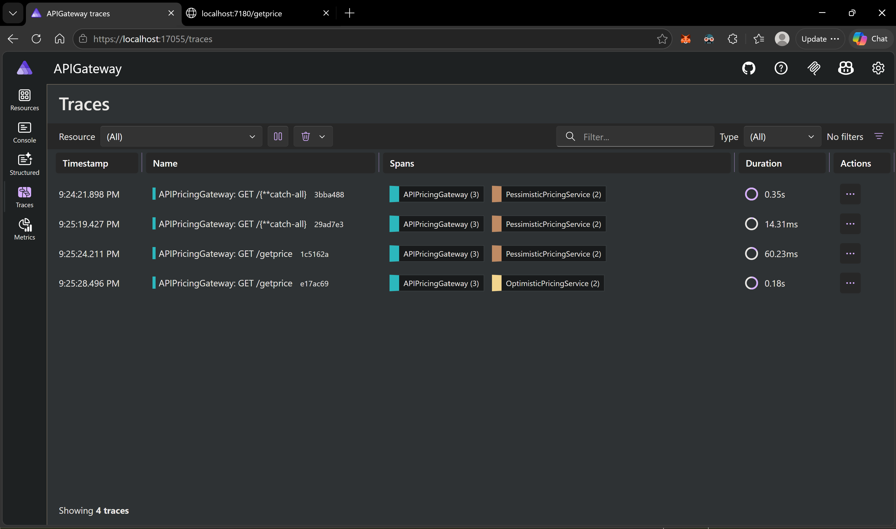
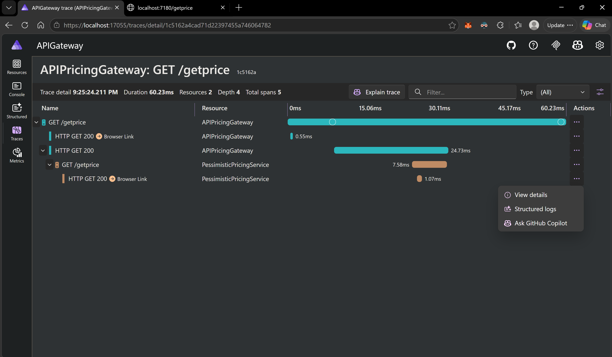
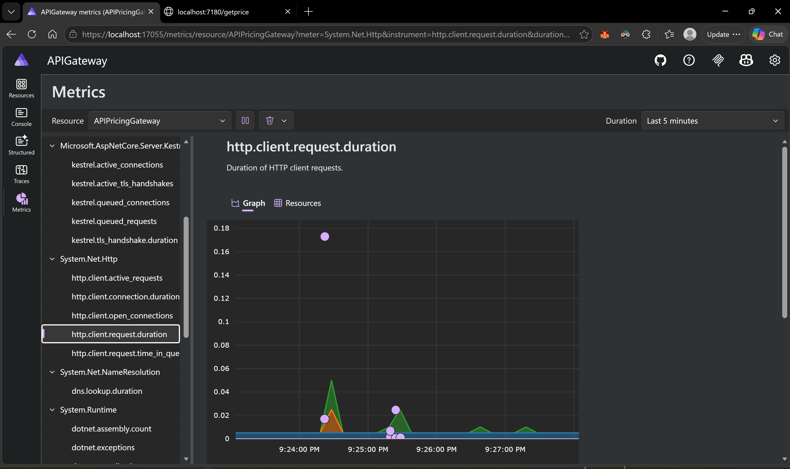

# Demo: Internal API Gateway with Reverse Proxy

A hands-on demonstration of building an **internal API gateway** using [YARP (Yet Another Reverse Proxy)](https://github.com/dotnet/yarp) and [.NET Aspire](https://learn.microsoft.com/en-us/dotnet/aspire/), running on **.NET 10**.

This project was built with three goals in mind:

1. **Showcase .NET Aspire** — demonstrate how Aspire orchestrates distributed applications, provides a developer dashboard, service discovery, health checks, and full OpenTelemetry observability out of the box.
2. **Explore YARP's capabilities** — walk through real reverse proxy scenarios including load balancing, path-based API versioning, rate limiting, request/response transforms, catch-all routing, and passive health checks.
3. **Build a simple internal API gateway** — provide a clear, reproducible reference for anyone looking to stand up their own API gateway using reverse proxies in .NET.

---

## Why "Internal" API Gateway?

This project is deliberately scoped as an **internal** API gateway — meaning it is designed to sit between services inside your network (or VPC), not as the public-facing front door for internet traffic. Here's why that distinction matters.

### The cost problem with self-hosted public gateways

A custom YARP gateway is fully capable of routing, authentication, authorization, rate limiting, and more. However, when exposed directly to the public internet, **every inbound request — legitimate or not — must be received, parsed, and processed by your application code running on compute you pay for**. In a DDoS attack or even a sustained traffic spike, your gateway becomes the bottleneck: it saturates CPU and memory, and you absorb the full cloud compute bill for processing millions of malicious requests that should never have reached your application in the first place.

### How managed cloud API gateways differ

Cloud providers offer managed API gateway products that operate at the **network edge**, far in front of your application infrastructure:

| Provider | Product |
|---|---|
| **Azure** | Azure API Management, Azure Front Door, Azure Application Gateway |
| **AWS** | Amazon API Gateway, CloudFront, Elastic Load Balancing |
| **Google Cloud** | Apigee, Cloud Endpoints, Cloud Load Balancing |

These services are built differently than a self-hosted reverse proxy:

- **Edge-level DDoS absorption** — traffic is filtered at the provider's global network edge (thousands of points of presence) before it ever reaches your virtual network. Volumetric attacks are mitigated at the infrastructure layer, not by your application.
- **Pay-per-request pricing** — you pay for legitimate API calls that pass through, not for raw network traffic your server had to process and reject. Most managed gateways don't charge you for requests blocked by WAF rules or rate limits.
- **Built-in WAF and bot protection** — Web Application Firewall rules, IP reputation lists, geo-blocking, and bot detection are applied at the edge with zero application code.
- **Global scale without capacity planning** — the provider handles horizontal scaling across regions automatically. You don't need to provision, monitor, or auto-scale gateway instances.
- **TLS termination at the edge** — SSL/TLS handshakes (expensive CPU operations) happen at the provider's edge, not on your compute.

### When a custom internal gateway makes sense

A self-hosted YARP gateway shines **inside** your network perimeter:

- **Service-to-service routing** — route traffic between internal microservices with fine-grained path, header, and version-based rules.
- **Internal rate limiting and quotas** — protect backend services from noisy-neighbor problems across internal teams.
- **Protocol translation and request shaping** — transform headers, rewrite paths, and aggregate responses before they reach internal consumers.
- **Zero external dependency** — no vendor lock-in, no per-request fees for internal traffic, full control over routing logic.

The pattern used in this project is ideal for the internal leg: a managed cloud gateway handles public ingress, DDoS protection, and coarse-grained auth at the edge, while your custom YARP gateway handles intelligent routing, versioning, and fine-grained traffic management between services behind the firewall.

---

## Table of Contents

- [Why "Internal" API Gateway?](#why-internal-api-gateway)
- [Architecture Overview](#architecture-overview)
- [Project Structure](#project-structure)
- [Prerequisites](#prerequisites)
- [Getting Started](#getting-started)
- [Demo Scenarios](#demo-scenarios)
  - [1. Round-Robin Load Balancing](#1-round-robin-load-balancing)
  - [2. Path-Based API Versioning](#2-path-based-api-versioning)
  - [3. Random Load Balancing](#3-random-load-balancing)
  - [4. Rate Limiting](#4-rate-limiting)
  - [5. Catch-All Routing](#5-catch-all-routing)
- [YARP Configuration Deep Dive](#yarp-configuration-deep-dive)
  - [Routes](#routes)
  - [Clusters](#clusters)
  - [Transforms](#transforms)
  - [Load Balancing Policies](#load-balancing-policies)
  - [Health Checks](#health-checks)
- [Alternative YARP Configuration Methods](#alternative-yarp-configuration-methods)
  - [Configuration File (appsettings.json)](#configuration-file-appsettingsjson)
  - [Programmatic / Fluent API (Code-Based)](#programmatic--fluent-api-code-based)
  - [Database / Custom Provider](#database--custom-provider)
  - [Configuration Filters](#configuration-filters)
- [.NET Aspire — What It Does and Why It Matters](#net-aspire--what-it-does-and-why-it-matters)
  - [Aspire Dashboard](#aspire-dashboard)
  - [Resource Dependency Graph](#resource-dependency-graph)
  - [Aggregated Console Logs](#aggregated-console-logs)
  - [Structured Logs](#structured-logs)
  - [Distributed Traces](#distributed-traces)
  - [Metrics](#metrics)
- [Tech Stack](#tech-stack)
- [License](#license)

---

## Architecture Overview

```
                         ┌──────────────────────────────────────────────┐
                         │            .NET Aspire AppHost              │
                         │  (Orchestration, Service Discovery, OTEL)   │
                         └──────────────────┬───────────────────────────┘
                                            │
                           ┌────────────────┼────────────────┐
                           │                │                │
                           ▼                ▼                ▼
                  ┌─────────────┐  ┌───────────────┐  ┌───────────────┐
   Clients ──►   │  API Pricing │  │  Pessimistic  │  │  Optimistic   │
                 │   Gateway    │  │  Pricing API  │  │  Pricing API  │
                 │   (YARP)     │  │               │  │               │
                 └──────┬───────┘  └───────────────┘  └───────────────┘
                        │                ▲                    ▲
                        │   ┌────────────┘                   │
                        └───┴────────────────────────────────┘
                         Routes requests based on path,
                        load balancing policy, and version
```

All client requests flow through the **APIPricingGateway**, which uses YARP to route, load balance, transform, and rate-limit traffic destined for two backend pricing services. Aspire orchestrates the entire distributed system and wires up service discovery so the gateway can resolve backend addresses by name at runtime.

---

## Project Structure

```
APIGateway/
├── APIGateway.slnx                          # Solution file
│
├── APIGateway.AppHost/                      # Aspire orchestration host
│   ├── AppHost.cs                           # Service registration & dependency wiring
│   ├── Assets/                              # Dashboard screenshots for documentation
│   └── Properties/launchSettings.json
│
├── APIGateway.ServiceDefaults/              # Shared defaults library
│   └── Extensions.cs                        # OpenTelemetry, health checks, resilience, service discovery
│
├── APIPricingGateway/                       # YARP reverse proxy gateway
│   ├── Program.cs                           # Gateway setup: YARP + rate limiting
│   ├── appsettings.json                     # YARP routes, clusters, transforms
│   └── APIPricingGateway.http               # HTTP test file with all demo scenarios
│
├── PricingAPI/                              # "Pessimistic" pricing service
│   ├── Program.cs                           # Minimal API: /getprice, /home
│   └── PricingAPI.http
│
└── ExternalPricingAPI/                      # "Optimistic" pricing service
    ├── Program.cs                           # Minimal API: /getprice, /home
    └── ExternalPricingAPI.http
```

| Project | Role | Key Packages |
|---|---|---|
| **APIGateway.AppHost** | Aspire orchestrator — registers services, declares dependencies, launches the dashboard | `Aspire.AppHost.Sdk 13.1.0` |
| **APIGateway.ServiceDefaults** | Shared library — OpenTelemetry, health checks, HTTP resilience, service discovery | `OpenTelemetry.*`, `Microsoft.Extensions.Http.Resilience`, `Microsoft.Extensions.ServiceDiscovery` |
| **APIPricingGateway** | YARP reverse proxy — routes, load balances, rate limits, and transforms requests | `Yarp.ReverseProxy 2.3.0`, `Microsoft.Extensions.ServiceDiscovery.Yarp` |
| **PessimisticPricingAPI** | Backend service returning conservative pricing forecasts | `Scalar.AspNetCore` (API docs) |
| **OptimisticPricingAPI** | Backend service returning optimistic pricing forecasts | `Scalar.AspNetCore` (API docs) |

---

## Prerequisites

- [.NET 10 SDK](https://dotnet.microsoft.com/download/dotnet/10.0) or later
- [.NET Aspire workload](https://learn.microsoft.com/en-us/dotnet/aspire/fundamentals/setup-tooling) installed:
  ```bash
  dotnet workload install aspire
  ```
- An IDE with Aspire support (Visual Studio 2022 17.9+, VS Code with C# Dev Kit, or JetBrains Rider)

---

## Getting Started

1. **Clone the repository**
   ```bash
   git clone https://github.com/DeepSigmaRepos/Demo-Internal-API-Gateway-With-Reverse-Proxy.git
   cd Demo-Internal-API-Gateway-With-Reverse-Proxy/APIGateway
   ```

2. **Run the Aspire AppHost** — this starts all three services and opens the Aspire dashboard:
   ```bash
   dotnet run --project APIGateway.AppHost
   ```

3. **Open the Aspire Dashboard** — navigate to the URL printed in the console (typically `https://localhost:17055`). From here you can see all running resources, their health status, logs, traces, and metrics.

4. **Send requests through the gateway** — use the `.http` test files in your IDE, or call the gateway directly:
   ```bash
   # Round-robin load balancing
   curl http://localhost:5064/getprice

   # API versioning
   curl http://localhost:5064/v1/getprice   # Always pessimistic
   curl http://localhost:5064/v2/getprice   # Always optimistic

   # Random load balancing
   curl http://localhost:5064/random

   # Catch-all (routes to pessimistic /home)
   curl http://localhost:5064/anything-here
   ```

---

## Demo Scenarios

### 1. Round-Robin Load Balancing

**Endpoint:** `GET /getprice`

Requests alternate between the Pessimistic and Optimistic pricing APIs using YARP's `RoundRobin` load balancing policy. Hit the endpoint repeatedly and watch the `Source` field in the JSON response toggle between services.

```bash
# First request  → Pessimistic Pricing API (Price: 100, Target: 30)
# Second request → Optimistic Pricing API  (Price: 100, Target: 500)
# Third request  → Pessimistic Pricing API ...
curl http://localhost:5064/getprice
```

Check the response headers — YARP adds `X-Served-By: YARP-Gateway` via a response transform, and the request carries `X-Gateway: APIPricingGateway` to the backend.

### 2. Path-Based API Versioning

**Endpoints:** `GET /v1/getprice` and `GET /v2/getprice`

YARP strips the version prefix and routes to a specific backend:

| Path | Routed To | Version Header |
|---|---|---|
| `/v1/getprice` | Pessimistic Pricing API | `X-Api-Version: v1` |
| `/v2/getprice` | Optimistic Pricing API | `X-Api-Version: v2` |

The `PathRemovePrefix` transform strips `/v1` or `/v2` so the backend only sees `/getprice`.

```bash
curl -i http://localhost:5064/v1/getprice
# Response header: X-Api-Version: v1
# Body: {"source":"Pessimistic Pricing API", ...}

curl -i http://localhost:5064/v2/getprice
# Response header: X-Api-Version: v2
# Body: {"source":"Optimistic Pricing API", ...}
```

### 3. Random Load Balancing

**Endpoint:** `GET /random`

Uses YARP's `Random` load balancing policy — each request independently and randomly picks a backend. The `PathSet` transform rewrites the entire path to `/home`, so the backend receives a request to its `/home` endpoint.

```bash
curl http://localhost:5064/random
# "Hello from Pessimistic Pricing API :("  — or —
# "Hello from Optimistic Pricing API!"
```

### 4. Rate Limiting

**Endpoint:** `GET /getprice` (same as round-robin, rate limit policy is applied to this route)

A **fixed-window rate limiter** is configured: **5 requests per 10-second window** with no queuing. The 6th request within the window is immediately rejected with `HTTP 429 Too Many Requests`.

```bash
# Send 6 requests quickly:
for i in $(seq 1 6); do curl -s -o /dev/null -w "%{http_code}\n" http://localhost:5064/getprice; done
# Output: 200 200 200 200 200 429
```

### 5. Catch-All Routing

**Endpoint:** `GET /{**catch-all}`

Any path that doesn't match a more specific route falls through to the Pessimistic Pricing API. The original path is forwarded as-is.

```bash
curl http://localhost:5064/this-route-does-not-exist
# Forwards to PessimisticPricingAPI at /this-route-does-not-exist
```

---

## YARP Configuration Deep Dive

This project configures YARP entirely through `appsettings.json`. Below is a breakdown of every concept demonstrated.

### Routes

Routes define **how incoming requests are matched** and **which cluster handles them**. YARP evaluates routes by specificity — more specific paths match before less specific ones.

```json
{
  "ReverseProxy": {
    "Routes": {
      "pricing-v1-route": {
        "ClusterId": "pessimistic-cluster",
        "Match": {
          "Path": "/v1/getprice"
        },
        "Transforms": [
          { "PathRemovePrefix": "/v1" },
          { "ResponseHeader": "X-Api-Version", "Append": "v1", "When": "Always" }
        ]
      }
    }
  }
}
```

Each route specifies:
- **`ClusterId`** — which cluster (group of backend servers) handles the request
- **`Match`** — the path pattern (supports `{**catch-all}` glob syntax)
- **`Transforms`** — optional request/response modifications
- **`RateLimiterPolicy`** — optional rate limiting policy name (defined in code)

### Clusters

Clusters define **groups of backend destinations** and how traffic is distributed among them.

```json
{
  "ReverseProxy": {
    "Clusters": {
      "pricing-roundrobin-cluster": {
        "LoadBalancingPolicy": "RoundRobin",
        "HealthCheck": {
          "Passive": { "Enabled": true }
        },
        "Destinations": {
          "pessimistic": {
            "Address": "https+http://PessimisticPricingService"
          },
          "optimistic": {
            "Address": "https+http://OptimisticPricingService"
          }
        }
      }
    }
  }
}
```

Key properties:
- **`LoadBalancingPolicy`** — algorithm for distributing requests (`RoundRobin`, `Random`, `LeastRequests`, `PowerOfTwoChoices`, `FirstAlphabetical`)
- **`HealthCheck`** — passive (track failures) or active (periodic probes)
- **`Destinations`** — named backend addresses; the `https+http://` scheme is an Aspire service discovery convention that prefers HTTPS and falls back to HTTP

### Transforms

Transforms modify requests **before** they reach the backend and responses **before** they reach the client.

| Transform Used | What It Does |
|---|---|
| `PathRemovePrefix` | Strips a path prefix (e.g., `/v1/getprice` → `/getprice`) |
| `PathSet` | Replaces the entire path (e.g., `/random` → `/home`) |
| `RequestHeader` with `Set` | Adds/overwrites a request header sent to the backend |
| `ResponseHeader` with `Append` | Appends a value to a response header sent to the client |

YARP supports many more transforms out of the box:
- `PathPrefix` — prepend a prefix to the path
- `PathPattern` — rewrite the path using route values
- `QueryValueParameter` — add/remove/set query string parameters
- `RequestHeadersCopy` — control which request headers are forwarded
- `ResponseHeaderRemove` — strip headers from the response
- `X-Forwarded` — manage `X-Forwarded-For`, `X-Forwarded-Proto`, etc.
- Custom transforms via `ITransformProvider` for anything not covered above

### Load Balancing Policies

YARP ships with several built-in policies:

| Policy | Behavior |
|---|---|
| `RoundRobin` | Cycles through destinations in order |
| `Random` | Picks a destination at random for each request |
| `LeastRequests` | Routes to the destination with the fewest active requests |
| `PowerOfTwoChoices` | Picks two random destinations, selects the one with fewer requests |
| `FirstAlphabetical` | Always picks the first destination alphabetically (useful for primary/fallback) |

This project demonstrates `RoundRobin` and `Random`. You can also implement `ILoadBalancingPolicy` for custom logic (e.g., weighted routing, geo-based routing, or canary deployments).

### Health Checks

This project uses **passive health checks**, which track consecutive failures from proxied requests and temporarily remove unhealthy destinations from rotation.

```json
"HealthCheck": {
  "Passive": {
    "Enabled": true
  }
}
```

YARP also supports **active health checks** that periodically send probe requests to a configurable health endpoint:

```json
"HealthCheck": {
  "Active": {
    "Enabled": true,
    "Interval": "00:00:30",
    "Timeout": "00:00:10",
    "Path": "/health"
  }
}
```

---

## Alternative YARP Configuration Methods

This project uses `appsettings.json` for simplicity, but YARP is designed to be **configuration-agnostic**. Here are other approaches for loading proxy configuration.

### Configuration File (appsettings.json)

The approach used in this project. Configuration is loaded at startup and can be hot-reloaded when the file changes (YARP watches for changes automatically).

```csharp
builder.Services.AddReverseProxy()
    .LoadFromConfig(builder.Configuration.GetSection("ReverseProxy"));
```

**Pros:** Simple, declarative, easy to understand and version control.
**Cons:** Static by nature; changes require editing the file (or redeploying).

### Programmatic / Fluent API (Code-Based)

Define routes and clusters entirely in C# using `InMemoryConfigProvider`. This is useful when routes need to be computed or when you want compile-time safety.

```csharp
var routes = new[]
{
    new RouteConfig
    {
        RouteId = "pricing-route",
        ClusterId = "pricing-cluster",
        Match = new RouteMatch { Path = "/getprice" }
    }
};

var clusters = new[]
{
    new ClusterConfig
    {
        ClusterId = "pricing-cluster",
        LoadBalancingPolicy = "RoundRobin",
        Destinations = new Dictionary<string, DestinationConfig>
        {
            { "api1", new DestinationConfig { Address = "https://api1.internal" } },
            { "api2", new DestinationConfig { Address = "https://api2.internal" } }
        }
    }
};

builder.Services.AddReverseProxy()
    .LoadFromMemory(routes, clusters);
```

**Pros:** Full C# power, compile-time safety, conditional route building.
**Cons:** Requires a code change and redeployment to modify routes.

### Database / Custom Provider

Implement `IProxyConfigProvider` to load routes and clusters from any data source — a relational database, Redis, Consul, Azure App Configuration, etc. This is ideal for multi-tenant gateways or systems where routes change frequently.

```csharp
public class DatabaseProxyConfigProvider : IProxyConfigProvider
{
    private readonly IDbConnectionFactory _db;

    public DatabaseProxyConfigProvider(IDbConnectionFactory db)
    {
        _db = db;
    }

    public IProxyConfig GetConfig()
    {
        // Query routes and clusters from your database
        var routes = _db.GetRoutes();
        var clusters = _db.GetClusters();
        return new DatabaseProxyConfig(routes, clusters);
    }
}

// Register it:
builder.Services.AddReverseProxy()
    .LoadFromCustomProvider();
builder.Services.AddSingleton<IProxyConfigProvider, DatabaseProxyConfigProvider>();
```

To trigger a reload when data changes, implement `IChangeToken` in your config class or call `IProxyConfigProvider.Update()` from a background service polling for changes.

**Pros:** Dynamic at runtime, no redeployment needed, supports multi-tenancy.
**Cons:** More complex, requires managing data consistency and change detection.

### Configuration Filters

YARP also supports **configuration filters** (`IProxyConfigFilter`) that intercept and modify configuration from any source before it is applied. This is useful for enriching or transforming routes — for example, adding default transforms, enforcing policies, or resolving placeholder values.

```csharp
public class AddDefaultHeadersFilter : IProxyConfigFilter
{
    public ValueTask<ClusterConfig> ConfigureClusterAsync(ClusterConfig cluster, CancellationToken cancel)
        => new(cluster); // No cluster changes

    public ValueTask<RouteConfig> ConfigureRouteAsync(RouteConfig route, ClusterConfig? cluster, CancellationToken cancel)
    {
        // Add a default response header to every route
        var transforms = route.Transforms?.ToList() ?? new List<IReadOnlyDictionary<string, string>>();
        transforms.Add(new Dictionary<string, string>
        {
            { "ResponseHeader", "X-Proxied" },
            { "Set", "true" },
            { "When", "Always" }
        });

        return new(route with { Transforms = transforms });
    }
}
```

---

## .NET Aspire — What It Does and Why It Matters

[.NET Aspire](https://learn.microsoft.com/en-us/dotnet/aspire/) is a cloud-ready stack for building observable, production-ready distributed applications. In this project, the Aspire **AppHost** orchestrates all three services with a few lines of code:

```csharp
var builder = DistributedApplication.CreateBuilder(args);

var pessimisticApi = builder.AddProject<Projects.PessimisticPricingAPI>("PessimisticPricingService");
var optimisticApi  = builder.AddProject<Projects.OptimisticPricingAPI>("OptimisticPricingService");

builder.AddProject<Projects.APIPricingGateway>("APIPricingGateway")
    .WithReference(pessimisticApi)
    .WaitFor(pessimisticApi)
    .WithReference(optimisticApi)
    .WaitFor(optimisticApi);

builder.Build().Run();
```

This gives you:
- **Automatic service discovery** — the gateway resolves `PessimisticPricingService` and `OptimisticPricingService` by name; no hardcoded URLs.
- **Startup ordering** — `WaitFor` ensures backends are healthy before the gateway starts accepting traffic.
- **Built-in OpenTelemetry** — structured logs, distributed traces, and metrics are collected and visualized without any third-party infrastructure.
- **HTTP resilience** — retry policies, circuit breakers, and timeouts are configured through the `ServiceDefaults` shared library.

Below are screenshots of the Aspire dashboard in action with this project.

### Aspire Dashboard

The main resource view shows all services, their state, start time, source project, and endpoint URLs at a glance.



### Resource Dependency Graph

Aspire visualizes how services depend on each other. The gateway depends on both pricing services — you can click any node to drill into its details.



Clicking a resource reveals its metadata: display name, state, health, start time, project path, launch profile, process ID, and endpoint URLs.



### Aggregated Console Logs

Console output from **all services** is aggregated into a single, filterable view. Filter by resource to isolate logs from a specific service.



### Structured Logs

Structured logs are searchable, filterable by level, and each entry can be drilled into to see full details, the associated trace, or the underlying log message.



### Distributed Traces

Traces show the full lifecycle of a request as it travels from the gateway to the backend service and back. Each span shows the resource, duration, and HTTP status — making it easy to pinpoint latency or failures in the chain.



Drilling into a trace reveals the full span waterfall: the gateway's outbound HTTP call, the backend's processing time, and the total end-to-end duration.



### Metrics

Aspire surfaces runtime and HTTP metrics from all services. Browse metrics by category (Kestrel, HttpClient, DNS, .NET Runtime) and visualize them over time.



---

## Tech Stack

| Technology | Version | Purpose |
|---|---|---|
| .NET | 10.0 | Runtime and SDK |
| ASP.NET Core | 10.0 | Web framework for all services |
| YARP | 2.3.0 | Reverse proxy engine |
| .NET Aspire | 13.1.0 | Orchestration, service discovery, observability |
| OpenTelemetry | 1.14.0 | Distributed tracing, metrics, and structured logging |
| Scalar | 2.13.22 | OpenAPI documentation UI for backend APIs |
| Microsoft.Extensions.Http.Resilience | 10.1.0 | Retry policies, circuit breakers, timeouts |
| Microsoft.Extensions.ServiceDiscovery | 10.1.0 | Dynamic service resolution |

---

## License

This project is provided as a learning resource. Feel free to use, modify, and distribute it.
